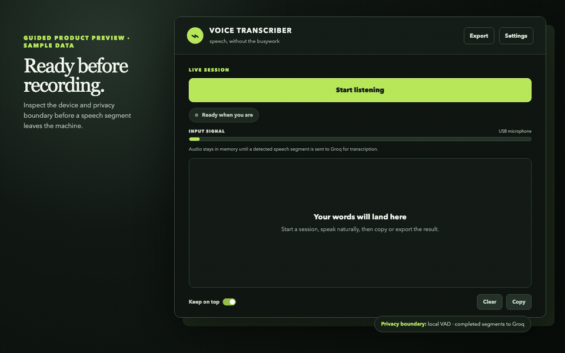

# Voice Transcriber

[](https://github.com/OthmaneBlial/audio-capture/actions/workflows/ci.yml)
[](https://github.com/OthmaneBlial/audio-capture/releases)
[](LICENSE)

**Dictate a thought, review it, and paste it anywhere on Linux.** Voice
Transcriber is a focused GTK desktop desk for notes, prompts, emails, tickets,
and drafts. It detects speech locally, sends only completed speech segments to
the visibly selected provider, and leaves the resulting text ready to copy or
explicitly export. The packaged path uses Groq; a source-only local prototype
is deliberately feature-flagged and labelled experimental.

**[Visit the project site](https://othmaneblial.github.io/audio-capture/)** ·
**[Read the data flow](docs/DATA-FLOW.md)** ·
**[Check supported environments](docs/SUPPORT.md)** ·
**[Inspect CLI contracts](docs/CLI.md)**



> This is a guided preview made from the current native interface design with
> synthetic sample text. Voice Transcriber does not generate a simulated
> transcript inside the application.

## The short path

1. Choose a detected microphone and confirm it with the local input meter.
2. Start listening and speak naturally.
3. Review the transcript as completed segments return.
4. Copy the text into your work, clear it, or export it deliberately.

There is no audio library to organise and no continuous background upload. A
bounded capture queue and bounded API worker pool keep failure and memory use
predictable when a device or connection is slow.

## What stays local and what leaves

Voice Transcriber is privacy-explicit, not an offline transcription engine.

| Surface | Current behaviour |
| --- | --- |
| Microphone frames | Held in a bounded in-memory queue; not saved by the app |
| Voice activity detection | Runs locally; silence is not submitted for transcription |
| Completed speech segment | Encoded in memory; sent to Groq in cloud mode or passed through a memory-backed descriptor to the local prototype |
| Input signal meter | Calculated locally and never persisted |
| Transcript | Remains in the GTK buffer until you copy, clear, or export it |
| Optional history | Disabled by default; when enabled, stores transcript text only with visible retention and clear-all controls |
| Export | Writes a local UTF-8 text file only after you choose a destination |
| Settings and API key | Saved only when you choose to save them, in an owner-only local config where supported |
| Analytics and crash reporting | None |

Read [the complete data-flow table](docs/DATA-FLOW.md) before using the app with
sensitive speech. Provider-side handling is controlled by the provider account
and its current policies, not by this application.

## See the interface before configuring a key

You can open the application, inspect Settings, discover microphone inputs, and
read the active privacy boundary without configuring Groq. In the packaged
cloud path, **Start listening** remains blocked until a plausible API key is
available; the app never substitutes a fake transcription.

On the first run, the app asks for a microphone, spoken language, and provider
configuration. Cloud setup requires an explicit confirmation that completed
speech segments will leave the device. A source session with the experimental
flag can instead choose user-supplied local runtime/model files. **Explore
first** keeps the app usable without accepting or configuring either boundary.

Install the checksum-verified, source-mapped `x86_64` Flatpak release asset, verify its
checksum, and open it without cloning the repository:

```bash
curl -LO https://github.com/OthmaneBlial/audio-capture/releases/download/v0.6.0/voice-transcriber-0.6.0-x86_64.flatpak
curl -LO https://github.com/OthmaneBlial/audio-capture/releases/download/v0.6.0/voice-transcriber-0.6.0-x86_64.flatpak.sha256
sha256sum --check voice-transcriber-0.6.0-x86_64.flatpak.sha256
flatpak install --user ./voice-transcriber-0.6.0-x86_64.flatpak
flatpak run io.github.othmaneblial.audio_capture
```

The bundle maps exactly to source tag `v0.6.0`. See the [complete Flatpak
instructions](docs/packaging/FLATPAK.md) and [evidence-based support
matrix](docs/SUPPORT.md) for runtime setup, updates, removal, and the
distinction between automated and real-hardware evidence.

## Configure a real transcription session

Create a Groq API key that you control, then use either the environment or the
owner-only Settings screen:

```bash
cp .env.example .env
# Edit .env and set GROQ_API_KEY to your newly created key.
source venv/bin/activate
python main.py --check-config
python main.py --list-devices
python main.py
```

Inside the app, choose a microphone from **Settings** if needed, then select
**Start listening** or press `Ctrl+Enter`. The input meter confirms that the
selected source is receiving audio without saving a recording. Use **Copy**
(`Ctrl+Shift+C`) or **Export** when the transcript is ready.

## Current capabilities

- Real microphone discovery and selection, including a machine-readable
  `--list-devices --json` command.
- A live, rate-limited local signal meter that does not record audio.
- Local speech detection with `webrtcvad`; silence is not sent as a
  transcription request.
- Groq Whisper transcription and optional translation into English.
- A small provider contract covering languages, translation, cancellation,
  limits, normalized errors, and a visible provider-specific data boundary.
- A keyboard-friendly recording desk with session state, copy, export,
  direct editing, undo/redo, focused push-to-talk, adjustable text, opacity,
  and always-on-top mode.
- Visible pending/complete/error state per recent speech segment without
  retaining segment audio or text in the state tracker.
- Plain text, Markdown, and timestamped owner-only exports with a destination
  confirmation; optional copy-on-final without simulated paste.
- Explicit opt-in local text history with 1–365 day retention, storage-path
  disclosure, per-entry deletion, and clear-all. It remains off by default.
- Clear failures for missing keys, connectivity, rate limits, microphone
  access, malformed audio, and a full request queue.
- Atomic settings writes and owner-only configuration permissions where the
  operating system supports them.

## Source installation details

`setup.sh` installs required Debian/Ubuntu system libraries, creates `venv/`,
and installs Python dependencies. For a manual setup:

```bash
sudo apt update
sudo apt install -y python3 python3-pip python3-venv python3-gi gir1.2-gtk-3.0 \
  portaudio19-dev python3-pyaudio libcairo2-dev libgirepository1.0-dev pkg-config
python3 -m venv venv --system-site-packages
source venv/bin/activate
python -m pip install --upgrade pip
python -m pip install -r requirements.txt
```

Add an application-menu entry after the environment is ready:

```bash
./install.sh
```

This remains the development path. The Flatpak release is the primary normal
installation; no Debian package or AppImage is claimed. Packaging evidence and
remaining real-device gates are tracked in [ROADMAP.md](ROADMAP.md).

### Experimental local whisper.cpp prototype

The source tree can expose a second provider only after an explicit process
flag. You supply a compatible `whisper-cli` executable and GGML model in
Settings; the app downloads neither and validates both before enabling Start.

```bash
VOICE_TRANSCRIBER_EXPERIMENTAL_LOCAL=1 python main.py
```

On Linux, each completed PCM segment is wrapped as WAV in memory and passed to
the local process through `memfd`; the app does not create a raw-audio file.
This mode is disabled inside the current Flatpak and is not called supported or
universally offline. Model licensing, size, RAM, speed, language quality, and
hardware acceleration depend on the files/build you choose. Read the
[provider matrix](docs/PROVIDERS.md) and [reproducible benchmark
harness](benchmarks/README.md).

## Configuration

Settings resolve in this order:

```text
defaults < ~/.config/voice-transcriber/config.json < environment variables
```

`GROQ_API_KEY` has the highest precedence and is never logged. Local settings
are atomically written with owner-only file permissions; `.env` is ignored by
Git. `python main.py --check-config` validates the active provider: a plausible
key for Groq, or the feature flag plus executable/model files for experimental
local mode. It exits with status `0` when ready and `2` when incomplete.

| Setting | Where | Notes |
| --- | --- | --- |
| `GROQ_API_KEY` | Environment or `.env` | Required to transcribe; use a key you control |
| Provider | Settings | Groq cloud, or experimental local only in explicitly flagged source sessions |
| Language | Settings | Auto-detect, English, French, Spanish, German, Italian, Portuguese, Arabic, and Chinese |
| Translate to English | Settings | Uses the provider translation endpoint |
| Microphone input | Settings or `--device INDEX` | Saved selection is reused; CLI option overrides it for one launch |
| Keep on top | Main window | Keeps the desk visible beside other work |
| Capture control | Settings | Toggle or focused hold-to-talk; no universal/global shortcut claim |
| Copy after final | Settings | Disabled by default; copies the full editable desk after a final segment |
| Local history | Settings | Disabled by default; text only, visible location and retention |

## Stable diagnostic commands

```bash
python main.py --check-config
python main.py --list-devices
python main.py --list-devices --json
python main.py --doctor
python main.py --doctor --json
# Explicit opt-in network/key check; never sends audio:
python main.py --doctor --probe-provider --json
python main.py --device 2
python main.py --version
python main.py --help
```

`--check-config` never prints the key or local paths. `--list-devices --json`
prints device metadata only and does not contact a provider. `--doctor` reports
readiness and remediation without contacting Groq unless `--probe-provider` is
explicitly supplied; local diagnostics validate only file/flag readiness. See [the versioned CLI
contracts](docs/CLI.md) for fields and exit codes.

## Architecture

```text
Microphone -> bounded frame queue -> local VAD -> bounded provider boundary -> GTK transcript
```

The UI runs on GTK's main loop. Capture and VAD run away from it. Groq uses a
bounded two-worker pool; the experimental local provider uses one worker and a
smaller bounded queue because model execution is CPU/RAM intensive.
See [the architecture note](docs/ARCHITECTURE.md) for lifecycle and failure
behaviour.

Read [Daily dictation controls](docs/DAILY-DICTATION.md) for editing, desktop
capability limits, export formats, and the opt-in history/deletion contract.

## Troubleshooting

| What you see | What to do |
| --- | --- |
| “No Groq API key is configured” | Set `GROQ_API_KEY` in `.env` or add a key in Settings, then start again |
| The microphone cannot open | Verify a microphone is connected and allowed in the desktop session; check PipeWire/PulseAudio settings |
| The wrong microphone is active | Run `python main.py --list-devices`, choose it in Settings, and start a new session |
| “Could not reach Groq” | Check the network, key, and provider access; the session remains recoverable |
| Rate-limit message | Wait before speaking more; the request queue is deliberately bounded |
| PyAudio cannot install | Install `portaudio19-dev`, then recreate the venv with `--system-site-packages` |

When opening a device issue, follow [the minimal safe report](docs/SUPPORT.md#hardware-verification-report).

## Development

```bash
python3 -m venv .venv
source .venv/bin/activate
python -m pip install -r requirements-dev.txt
python -m unittest discover -s tests -v
ruff check .
python -m compileall -q audio transcription ui config.py main.py
```

The unit suite fakes external native/API boundaries. It exercises configuration
precedence and permissions, microphone discovery and selection, local meter
normalisation, VAD segmentation, error normalisation, WAV conversion, the
request bound, provider capabilities/data boundaries, memory-backed local CLI
input, benchmark math, edit snapshots, export modes, history
retention/deletion, and desktop capability gating without requiring a
microphone, Groq account, local model, or corpus download.

Read [CONTRIBUTING.md](CONTRIBUTING.md) and the
[Code of Conduct](CODE_OF_CONDUCT.md) before opening a pull request.

## Security and responsible disclosure

Do not report credentials, recordings, transcripts, or suspected privacy flaws
in a public issue. Follow [SECURITY.md](SECURITY.md) for private reporting. If a
credential ever reached Git history, rotate it in the issuing service even
after removing the current file.

## Roadmap

The dependency-ordered [product roadmap](ROADMAP.md) prioritises public proof,
normal Linux packaging, daily dictation, provider choice, verifiable privacy,
and a sustainable contribution loop.

## License

Released under the [MIT License](LICENSE).
