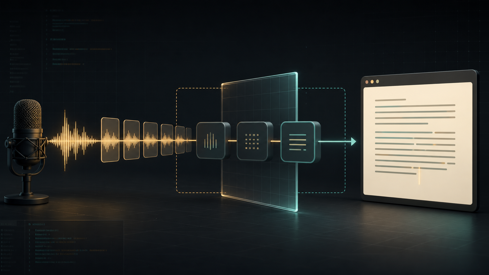

# Building an open-source Linux voice-to-text app



The honest architecture diagram for most cloud transcription tools needs an
arrow leaving the device. Voice Transcriber keeps that arrow—and makes it
visible. It is an **open-source Linux voice-to-text** desk for short notes,
prompts, emails, tickets, and drafts, built around a question users can answer
before speaking: what stays here, and what leaves?

That question changed the product more than the choice of model or toolkit.
Voice Transcriber is not a meeting recorder or a background microphone. It is
a small GTK application for getting a thought into editable text, then deciding
whether to copy, export, retain, or discard it.

You can [watch the synthetic three-state tour](https://othmaneblial.github.io/audio-capture/#proof)
before installing anything.

## Start with the job, not the transcription stack

Typing sometimes interrupts the thought you are trying to preserve. The useful
workflow is short: confirm the microphone, speak, review the words, then move
them into the tool where they belong.

That focus rules out a surprising amount of scope. There is no recording
library, meeting timeline, automatic summarizer, project-owned account, or
silent keyboard injection. The app keeps an editable transcript desk and gives
the user explicit Copy, Clear, and Export actions. Transcript history exists,
but it is text-only, opt-in, retention-limited, and off by default.

The result is less ambitious than a general voice assistant and more useful as
a daily Linux dictation app.

## Local VAD is useful—but it is not offline transcription

The supported data path is deliberately easy to draw:

```text
microphone -> bounded PCM frames -> local VAD -> completed speech segment
           -> Groq transcription -> editable GTK transcript
```

Microphone frames are read as 30 ms, 16 kHz mono PCM and held in a bounded
queue. Voice activity detection runs on the device. Silence does not become a
standalone transcription request. When a speech segment closes, cloud mode
wraps it as WAV in memory and sends it to Groq.

That is a meaningful reduction in what crosses the boundary, but it is not
“fully offline.” The interface says which provider is active, onboarding asks
for explicit acknowledgement before external transmission, and the project
[documents the field-level data flow](https://github.com/OthmaneBlial/audio-capture/blob/main/docs/DATA-FLOW.md).
Provider-side processing is governed by the user's account and current provider
terms; the app does not invent a retention promise it cannot enforce. Groq's
current [speech-to-text documentation](https://console.groq.com/docs/speech-to-text)
and [customer-data documentation](https://console.groq.com/docs/your-data) are
linked from the privacy notice so that users can inspect the external boundary
directly.

## Bounded work is both a reliability and privacy decision

Audio software has an awkward failure mode: if capture or the network slows
down, unbounded work can quietly accumulate. Voice Transcriber puts a fixed
limit on both sides.

The capture queue drops the oldest frames if processing falls behind, favoring
real-time behavior over unlimited memory growth. The Groq provider uses a small
two-worker pool and a bounded pending queue. A full queue becomes a visible,
normalized error instead of hidden background work. Stop signals capture,
allows the processor a bounded wait, and flushes one final valid segment.

The same rule applies to output. Recent request state stores an identifier and
pending/complete/error status, not segment audio or transcript content. Logs
and diagnostics omit keys, response bodies, transcript text, and private model
paths. The [threat model](https://github.com/OthmaneBlial/audio-capture/blob/main/docs/THREAT-MODEL.md)
also names the boundaries outside the app: the operating system, provider,
clipboard manager, exports, backups, and user-supplied executables.

## A provider interface should expose tradeoffs, not hide them

Groq `whisper-large-v3-turbo` remains the supported packaged path. Behind it is
a small provider contract describing capabilities, languages, translation,
cancellation, limits, normalized errors, and a human-readable data boundary.

There is also a source-only whisper.cpp prototype. It is gated by an explicit
environment flag, requires a user-supplied executable and model, downloads
nothing automatically, and on Linux passes the WAV through a memory-backed
descriptor instead of creating a raw-audio file. It is disabled in Flatpak.

That prototype is intentionally not called supported or universally offline.
Model licensing, download size, memory use, acceleration, language quality, and
laptop performance all depend on the files and build the user chooses. It must
pass the same installation and physical-device gates as the cloud path before
the provider selector can become a promise rather than an experiment. The
[provider matrix](https://github.com/OthmaneBlial/audio-capture/blob/main/docs/PROVIDERS.md)
keeps that difference explicit.

## Publish the benchmark receipt, not an accuracy slogan

The local prototype has a reproducible benchmark harness using the licensed
LibriSpeech `test-clean` corpus. One pinned run selected 25 speakers
deterministically and evaluated whisper.cpp `tiny.en` on an AMD EPYC 7763
GitHub runner. It produced 37 word errors over 627 reference words: 5.90% WER,
with 1,043.810 ms p50 and 1,508.576 ms p95 wall-clock file-transcription
latency.

Those numbers are useful only with their context. They are not end-to-end
microphone latency, a claim about every accent or language, or a universal
“94.1% accurate” score. The project publishes the corpus checksum, exact model
checksum, whisper.cpp revision, selection method, hardware, numerator,
denominator, percentiles, and [unedited receipt](https://github.com/OthmaneBlial/audio-capture/blob/main/benchmarks/results/local-tiny-en-github-runner.json).
The LibriSpeech corpus and license context are available from
[OpenSLR](https://openslr.org/12/).

## Make the package independently inspectable

The public install path is one source-mapped `x86_64` Flatpak with a SHA-256
checksum. The sandbox asks for Wayland, fallback X11/IPC, PulseAudio, and the
network needed by Groq. It does not request broad home or host filesystem
access. Flatpak's own documentation explains both
[manifest structure](https://docs.flatpak.org/en/latest/manifests.html) and
[sandbox permissions](https://docs.flatpak.org/en/latest/sandbox-permissions.html).

Release checks now cover version and changelog consistency, the Python matrix,
tests, coverage, dependency auditing, static analysis, package builds,
manifest/AppStream/repository linting, an offline no-download rebuild,
installed-bundle smoke, and clean removal. The stable release workflow is also
designed to publish a test report, CycloneDX SBOM, checksum, and GitHub artifact
attestations. GitHub documents how those
[artifact attestations are verified](https://docs.github.com/en/actions/how-tos/secure-your-work/use-artifact-attestations/use-artifact-attestations).

Configuration is not release proof. Those v1 artifacts should be claimed only
after the tag workflow succeeds and the public downloads verify against the
release commit.

## The remaining proof belongs in public

Automated GTK under Xvfb cannot prove a physical microphone on GNOME Wayland
with PipeWire or another desktop using PulseAudio. A benchmark runner cannot
prove laptop battery behavior. A unit test cannot perform an Orca review.

Those are useful contribution boundaries. Pick one open proof gap—your Linux
audio stack, a screen-reader pass, a translated install guide, a benchmark
reproduction, a provider fixture, or release-asset verification—and submit the
smallest sanitized result another contributor can repeat.

- [Install and support boundary](https://github.com/OthmaneBlial/audio-capture/blob/main/docs/SUPPORT.md)
- [Contributor map](https://github.com/OthmaneBlial/audio-capture/blob/main/docs/contributing/README.md)
- [Good first issues](https://github.com/OthmaneBlial/audio-capture/labels/good%20first%20issue)
- [Project site and guided demo](https://othmaneblial.github.io/audio-capture/)

Do not attach recordings, transcripts, credentials, config files, home paths,
or full environment dumps. The project needs repeatable evidence, not private
data—and it does not need a generic request for stars.
